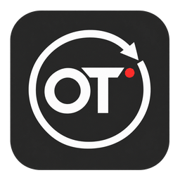
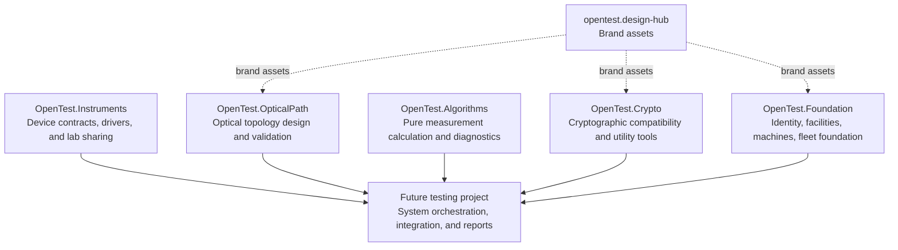

  

# OpenTest

OpenTest is a modular ecosystem for laboratory optical-module testing. Its repositories deliberately separate reusable business services, instrument integration, optical-path design, deterministic measurement algorithms, cryptographic utilities, and shared visual assets.

It is not a monorepo. Each project owns its source code, releases, architecture decisions, risks, and detailed design documents.

## Ecosystem map

The arrows to the future testing project express integration, not source-code coupling. Domain projects publish focused capabilities; the testing layer will own test sequencing, product rules, final pass/fail decisions, reporting, and integration verification.

## Repositories

| Repository | Responsibility | Deliberate boundary |
| --- | --- | --- |
| [OpenTest.Foundation](https://github.com/OpenTest-Labs/opentest.foundation) | Identity, facilities, machine management, and reusable platform services. | It does not own instrument protocols, optical calculations, or test execution. |
| [OpenTest.Instruments](https://github.com/OpenTest-Labs/opentest.instruments) | Instrument contracts, Windows-capable drivers, and shared-lab instrument hosting. | It does not own product test logic or measurement-result interpretation. |
| [OpenTest.OpticalPath](https://github.com/OpenTest-Labs/opentest.opticalpath) | Versioned optical topology contracts, route validation, path plans, and the offline designer. | It does not bind logical paths to physical drivers or perform calibrated measurements. |
| [OpenTest.Algorithms](https://github.com/OpenTest-Labs/opentest.algorithms) | Pure, reproducible calculations, fitting, evidence, and diagnostics for completed measurement data. | It does not acquire data, parse device exports, control instruments, or decide product pass/fail. |
| [OpenTest.Crypto](https://github.com/OpenTest-Labs/opentest.crypto) | Cryptographic compatibility helpers and narrowly scoped cryptographic utilities. | It does not own licensing, remote KMS/HSM, or organization-wide key governance. |
| [opentest.design-hub](https://github.com/OpenTest-Labs/opentest.design-hub) | OpenTest brand assets. | It does not replace project-level architecture or implementation documentation. |
| `opentest.skills` | Reserved repository for OpenTest-specific reusable skills and workflow assets. | It is not an application runtime dependency. |

## Tooling direction

Small, single-purpose developer and desktop tools normally live with the domain they explain or validate. A dedicated testing project is reserved for tools that coordinate multiple domains or validate the assembled system.

| Project | Planned focused tooling |
| --- | --- |
| OpenTest.Algorithms | A scriptable algorithm CLI, a result-explanation workbench, and golden-fixture/method-version difference review. |
| OpenTest.Crypto | A crypto CLI, ciphertext inspection and controlled migration, and lightweight local key use with a clear boundary from remote key governance. |
| Future testing project | Test orchestration, integrated regression, test reporting, product rules, and final pass/fail authority. |

These are planning directions, not released components. Their detailed scope, implementation decisions, and acceptance criteria are recorded in the relevant project repository when work is approved.

## Documentation and governance

- Durable, project-specific decisions belong in that repository's `docs/design/`, `docs/adr/`, and `docs/ledger/` records.
- Shared engineering rules remain in the versioned [`dev-standards`](https://github.com/xin-pu/dev-standards) knowledge base; each maintained repository records its adopted revision and any approved project-specific deviations.
- A cross-project capability should depend on published contracts or stable interfaces, not another repository's internal implementation details.

## Brand

The OpenTest glyph is locked: do not alter its shapes, proportions, or red status dot. Production assets and usage guidance live in [opentest.design-hub](https://github.com/OpenTest-Labs/opentest.design-hub).
